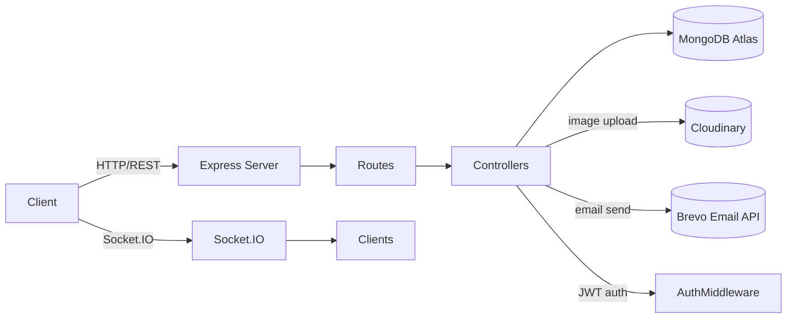
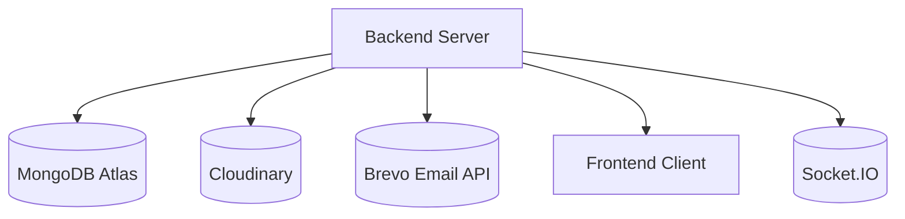

# Backend Design Document

## Overview

This backend is a Node.js + Express API for a real estate platform. It provides:
- User authentication and authorization
- Role-based access for buyers, sellers, and admins
- Property listing management
- Inquiry submission and management
- Wishlist management
- Real-time chat messaging
- Image upload via Cloudinary
- Email notifications via Brevo SMTP API
- MongoDB persistence via Mongoose

## Folder Structure

```text
Backend/
  ├─ config/
  │   ├─ cloudinary.js
  │   └─ db.js
  ├─ controller/
  │   ├─ admin.controller.js
  │   ├─ auth.controller.js
  │   ├─ inquiry.controller.js
  │   ├─ property.controller.js
  │   ├─ user.controller.js
  │   └─ wishlist.controller.js
  ├─ middlewares/
  │   ├─ auth.middleware.js
  │   └─ upload.middleware.js
  ├─ models/
  │   ├─ chat.models.js
  │   ├─ inquiry.model.js
  │   ├─ property.model.js
  │   ├─ usermodels.js
  │   └─ wishlist.model.js
  ├─ routes/
  │   ├─ admin.routes.js
  │   ├─ auth.routes.js
  │   ├─ chats.routes.js
  │   ├─ inquiry.routes.js
  │   ├─ property.routes.js
  │   ├─ user.routes.js
  │   └─ wishlist.routes.js
  ├─ utils/
  │   ├─ sendEmails.js
  │   └─ uploadTocloudinary.js
  ├─ server.js
  ├─ package.json
  └─ package-lock.json
```

## System Architecture

### High-level flow



### Component diagram



## Main Entry: `server.js`

### Purpose
Starts the Express app, configures middleware, registers routes, initializes Socket.IO, and starts listening on port 5000.

### Responsibilities
- Connects to MongoDB using `connectdb()`
- Applies CORS only for `http://localhost:5173`
- Parses request JSON bodies
- Mounts route modules for authentication, users, properties, inquiries, wishlists, admin, and chat
- Serves a root health check endpoint at `GET /`
- Starts Socket.IO for real-time chat

### Socket.IO behavior
- `joinChat` — joins a chat-specific room
- `sendMessage` — broadcasts `receiveMessage` to the chat room
- `disconnect` — logs disconnection

## Config

### `config/db.js`
- Connects to MongoDB Atlas via Mongoose
- Currently uses a hard-coded connection string
- Should use environment variable for security in production

### `config/cloudinary.js`
- Configures Cloudinary credentials from environment variables
- Exports the `cloudinary` client for image uploads

## Routes

### `routes/auth.routes.js`
Routes for authentication and email/password flows:
- `POST /register`
- `POST /login`
- `GET /me`
- `POST /verify-email`
- `POST /forgot-password`
- `POST /reset-password/:token`

`GET /me` is protected by authentication middleware.

### `routes/user.routes.js`
User profile routes:
- `GET /profile`
- `GET /profile/:id`
- `PUT /profile`

All routes use `protect` middleware.

### `routes/property.routes.js`
Property management routes:
- `GET /` — list all properties
- `POST /` — add a new property
- `GET /my` — seller-owned properties
- `PUT /:id` — update property
- `DELETE /:id` — delete property
- `PATCH /:id/status` — update property sale status
- `GET /counts` — counts by property type
- `GET /:id` — property details
- `GET /seller/dashboard` — seller dashboard statistics

Seller-only routes use `protect` + `authorize("seller")`.
File upload uses `Upload.array("images", 10)`.

### `routes/inquiry.routes.js`
Inquiry routes:
- `POST /` — buyer sends inquiry
- `GET /seller` — seller views inquiries
- `PATCH /:id/read` — mark inquiry as read

Uses `protect` plus role-based authorization.

### `routes/wishlist.routes.js`
Wishlist routes:
- `POST /:propertyId` — add property to wishlist
- `GET /` — get wishlist
- `DELETE /:propertId` — remove from wishlist

Uses `protect`.

### `routes/admin.routes.js`
Admin routes:
- `GET /users`
- `PATCH /users/:id/block`
- `DELETE /users/:id`
- `GET /properties`
- `DELETE /properties/:id`
- `GET /inquiries`
- `GET /stats`
- `GET /pending-seller`
- `PATCH /approved-seller/:id`

All routes require `protect` and `authorize("admin")`.

### `routes/chats.routes.js`
Chat routes:
- `POST /start` — start or reuse a chat
- `POST /send` — send a chat message
- `GET /user` — get chats for current user
- `GET /:chatId` — get a specific chat
- `DELETE /:chatId` — delete a chat
- `DELETE /:chatId/message/:messageId` — delete a chat message

Uses `protect` for all chat actions.

## Controllers

### `controller/auth.controller.js`
Handles authentication:
- `Register` — user registration, password hashing, email verification token, seller approval flow
- `login` — validate credentials, check verification, block status, return JWT
- `getMe` — authenticated profile lookup
- `verifyEmail` — verify email token and activate account
- `forgotPassword` — issue password reset token via email
- `resetPassword` — validate token and update password

### `controller/user.controller.js`
User profile actions:
- `getProfile` — current user profile without password
- `getPublicprofile` — public profile by user ID
- `updateProfile` — updates user fields and uploads profile picture

### `controller/property.controller.js`
Property management and search:
- `addproperty` — create listing with Cloudinary image upload
- `getMyProperties` — seller’s own listings
- `updateProperty` — update listing fields and images
- `deleteProperty` — delete listing and remove Cloudinary images
- `updatePropertyStatus` — change status between `sale` and `sold`
- `getAllProperties` — search, filter, sort listings
- `getPropertyDetails` — view property details and increment unique views
- `getSellerDashboard` — seller stats report
- `getPropertyCount` — aggregate count by property type

### `controller/inquiry.controller.js`
Inquiry management:
- `sendInquiry` — buyer sends message to seller
- `getSellerInquiry` — seller views inquiries
- `markAsRead` — mark an inquiry as read

### `controller/wishlist.controller.js`
Wishlist behavior:
- `addwishlist` — add a property to wishlist
- `getWishlist` — list user wishlist items
- `removewishlist` — remove a wishlist entry

### `controller/admin.controller.js`
Admin management:
- `getAllUsers`
- `blockUser`
- `deleteUser`
- `getAllProperties`
- `deleteProperty`
- `getAllInquiry`
- `getDashboardStats`
- `getPendingSeller`
- `approveSeller`

## Models

### `models/usermodels.js`
User schema fields:
- `name`, `email`, `password`
- `role` (`buyer`, `seller`, `admin`)
- `phone`, `profilepic`, `address`
- `isBlocked`, `isApproved`, `isVerified`
- `verificationToken`, `resetPasswordToken`, `resetPasswordExpire`

### `models/property.model.js`
Property schema fields:
- `title`, `description`, `price`, `city`, `area`, `pincode`
- `propertyType`, `bhk`, `bathrooms`, `areaSize`, `furnishing`
- `amenities`, `status`, `images`
- `seller` reference to `User`
- `views`, `viewedBy`, `timestamps`

### `models/inquiry.model.js`
Inquiry schema fields:
- `property` reference to `Property`
- `buyer`, `seller` references to `User`
- `message`, `isRead`, `timestamps`

### `models/wishlist.model.js`
Wishlist schema fields:
- `user` reference to `User`
- `property` reference to `Property`

### `models/chat.models.js`
Chat schema fields:
- `property` reference to `Property`
- `buyer`, `seller` references to `User`
- `messages[]` with `sender`, `text`, `image`, `createdAt`

## Middlewares

### `middlewares/auth.middleware.js`
- `protect` — validates JWT token, loads user, and blocks blocked accounts
- `authorize(...roles)` — ensures user role is allowed for the route

### `middlewares/upload.middleware.js`
- Uses Multer memory storage for file uploads

## Utilities

### `utils/sendEmails.js`
- Sends email through Brevo API
- Requires `BREVO_API_KEY` and `EMAIL_USER`

### `utils/uploadTocloudinary.js`
- Uploads file buffer to Cloudinary using `upload_stream`
- Returns the Cloudinary result object

## Request Flow Examples

### Register flow
1. Client calls `POST /api/auth/register`
2. `auth.routes.js` routes request to `Register`
3. Controller hashes password and saves user
4. Sends verification email
5. Returns success response

### Add property flow
1. Client calls `POST /api/property` with form data and images
2. `protect` + `authorize("seller")` validate seller
3. `Upload.array("images", 10)` parses files
4. Controller uploads images and saves property
5. Returns created property

### Property detail flow
1. Client calls `GET /api/property/:id`
2. Controller loads property and seller
3. Updates view count for unique visitor
4. Returns property and similar suggestions

### Chat flow
1. Client connects with Socket.IO
2. Emits `joinChat`
3. Emits `sendMessage`
4. Server broadcasts `receiveMessage` to room

## Notes

- `wishlist.controller.js` currently contains a bug: it queries `user: "req.user._id"` instead of `user: req.user._id`
- `config/db.js` should use env variables instead of a hard-coded MongoDB string
- `auth.middleware.js` has a stray backtick in an error response
- `inquiry.model.js` property field name is capitalized as `Property`, while controller logic expects lowercase `property`

## Summary

This backend uses a layered architecture:
- `server.js` for application startup
- `routes/` for HTTP route definitions
- `controller/` for request handling and business rules
- `models/` for MongoDB schema definitions
- `middlewares/` for authentication and file upload
- `utils/` for Cloudinary and email helpers

It supports buyers, sellers, admins, property listings, inquiries, wishlists, and chat.
